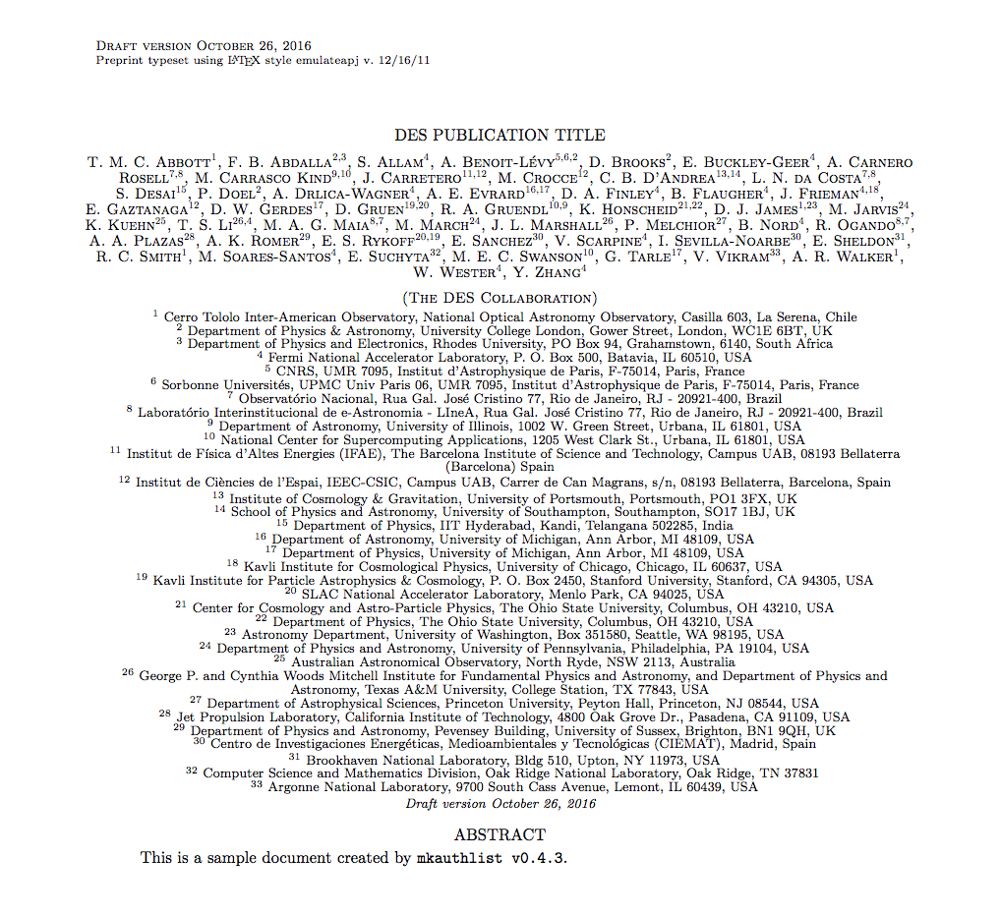

[](https://travis-ci.org/kadrlica/mkauthlist)
[](https://pypi.python.org/pypi/mkauthlist)
[](../../releases)
[](../../)

mkauthlist
==========

Make long latex author lists from csv files.

Installation
------------

The ``mkauthlist`` script is distributed via ``pip`` and should work on Python version >= 2.7:

```text
> pip install mkauthlist
```

You can also clone the repository and install by hand:

```text
> git clone git@github.com:kadrlica/mkauthlist.git
> cd mkauthlist
> python setup.py install
```

Usage
-----

The core usage is to transform a pre-sorted file of comma separated values into an author list suitable for input in the latex. The ``mkauthlist`` script provides several options for more complicated operations when generating the list.

```text
> mkauthlist --help
usage: mkauthlist [-h] [-a order.csv] [-d] [-f] [-i IDX]
                   [-j {aj,apj,elsevier,emulateapj,mnras,prd,prl}] [-s] [-V]
                   author_list.csv
                   [author_list.tex]
 
A simple script for making latex author lists from the csv file
produced by the DES Publication Database (PubDB).
 
Some usage notes:
(1) By default, the script does not tier or sort the author list. The
'--sort' option does not respect tiers.
(2) An exact match is required to group affiliations. This should not
be a problem for affiliations provided by the PubDB; however, be
careful if you are editing affiliations by hand.
(3) The script parses quoted CSV format. Latex umlauts cause a problem
(i.e., the Munich affiliation) and must be escaped in the CSV
file. The PubDB should do this by default.
(4) There are some authors in the database with blank
affiliations. These need to be corrected by hand in the CSV file.
 
positional arguments:
  DES-XXXX-XXXX_author_list.csv
                        Input csv file from DES PubDB
  DES-XXXX-XXXX_author_list.tex
                        Output latex file (optional).
 
optional arguments:
  -h, --help            show this help message and exit
  -a order.csv, --aux order.csv
                        Auxiliary author ordering file (one lastname per
                        line).
  -d, --doc             Create standalone latex document.
  -f, --force           Force overwrite of output.
  -i IDX, --idx IDX     Starting index for aastex author list (useful for
                        multi-collaboration papers).
  -j {aj,apj,elsevier,emulateapj,mnras,prd,prl}, --journal {aj,apj,elsevier,emulateapj,mnras,prd,prl}
                        Journal name or latex document class.
  -s, --sort            Alphabetize the author list (you know you want to...).
  -V, --version         Print version number and exit.
```

Example
-------
Start with the author list file generated by the PubDB system (for DES members, see [here](http://dbweb6.fnal.gov:8080/DESPub/app/PB/pub/author_list/DES-2015-0109_author_list.csv?pubid=109)).

```text
> base="example_author_list"
> csv="${base}.csv" 
> tex="${base}.tex" 
> pdf="${base}.pdf" 
> png="${base}.png" 
  
> mkauthlist --sort -f --doc -j emulateapj $csv $tex 
> pdflatex $tex 
```

The output should looks something like this:



One common usecase is to sort the builder list but not the first tier authors. This can be achieved by adding an auxiliary order file ``--aux order.csv`` specifying the ordering of the first tier authors and then alphabetically sorting the list with the ``--sort`` option.
